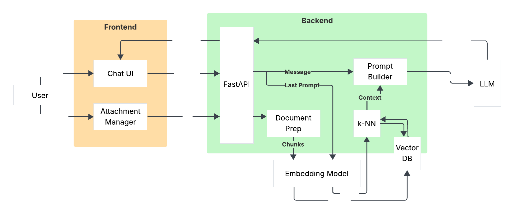

# avsRAG (🚧🏗️)

🧠🗃️ (a very simple)RAG is a locally hosted LLM interface that integrates a Retrieval-Augmented Generation pipeline to improve the relevance of responses using user-provided documents. Designed with data privacy in mind, it enables offline use of open-weight language models for tasks like tech research, document reviews, or other data sensitive professional applications. <br>
The system retrieves contextual data using an embedding model and performs similarity searches through a vector store (with plans to integrate PostgreSQL). This allows the LLM to generate grounded responses from custom and proprietary data.<br>
<br>
The frontend is built with React and Vite for a fast and simple user experience, while the backend runs on FastAPI with Uvicorn, supporting real-time, asynchronous communication over WebSockets.

Note 04/05/2025: A few days ago, Ollama dropped a new version that includes a very good looking UI with some features that this project was focused on. Nonetheless, this project will continue, evolving with additional features and improvements that are not present in the Ollama UI (such as full control over the vector store, document management, and more).
<br><br>
Note 08/05/2025: As of today, Ollama and llama.cpp have partnered with OpenAI to have a GGUF quantized version of gpt-oss ready for today's launch. Not only is this awesome, but also proves that even in the era of Big AI, there's still a strong push for open-source innovation as well as meaningful support for offline models providing privacy and transparency to users. <br>
P.S. This also explains last week's Ollama update that added a bunch of features and improvements to Ollama. Still, I added RAG before them ;-)




## Features
- **Language Model**: Integrates with Ollama's language models for generating responses.
- **Simple Interface**: Provides a straightforward interface for querying and retrieving information.
- **Document Management**: Allows for adding and managing documents in the vector database.
- **Vector Database**: [ ! ] Working on implementing Postgres pgvector support.

# To-Do
- [x] Implement Ollama language model support.
- [x] Implement query chat interface.
- [x] Implement simple vector store.
- [ ] Implement document upload UI.
- [ ] Implement vector database interface.
- [ ] Implement Postgres pgvector support.
- [ ] Implement document management.
- [ ] Clean up and push test cases.

As of right now, the system is fully functional with any Ollama language model through a simple vector store. The document upload web UI and vector database interface with Postgres are in progress, so document upload is currently done through direct API calls.

## 🚀 Quickstart

**Clone & install main CLI runner**  
  ```bash
  git clone https://github.com/nicosept/avsRAG.git

  # Virtual environments are good practice!
  python3 -m venv .venv
  source .venv/bin/activate # OR .venv\Scripts\activate for Windows

  pip install -e .
  ```

**Install duo server dependencies**  
  ```bash
  # Backend
  cd ./backend
  pip install .

  # Frontend
  cd ./frontend
  npm install
  ```

**Run the application with:**  
  ```bash
  avsrag run
  ```
<br>

**External dependencies**  
  - [Ollama](https://ollama.com/) for language model support.
  - [Postgres](https://www.postgresql.org/) with pgvector for vector database support. (Not yet required)


## Future Work
- **Multiple LLM API support**: Add support for more language model providers, starting with OpenAI.
- **Multi-User Support**: Implement user authentication and session management for a single server with multiple user architecture.
- **Multiple Vector Database support**: Implement support for multiple vector databases.
